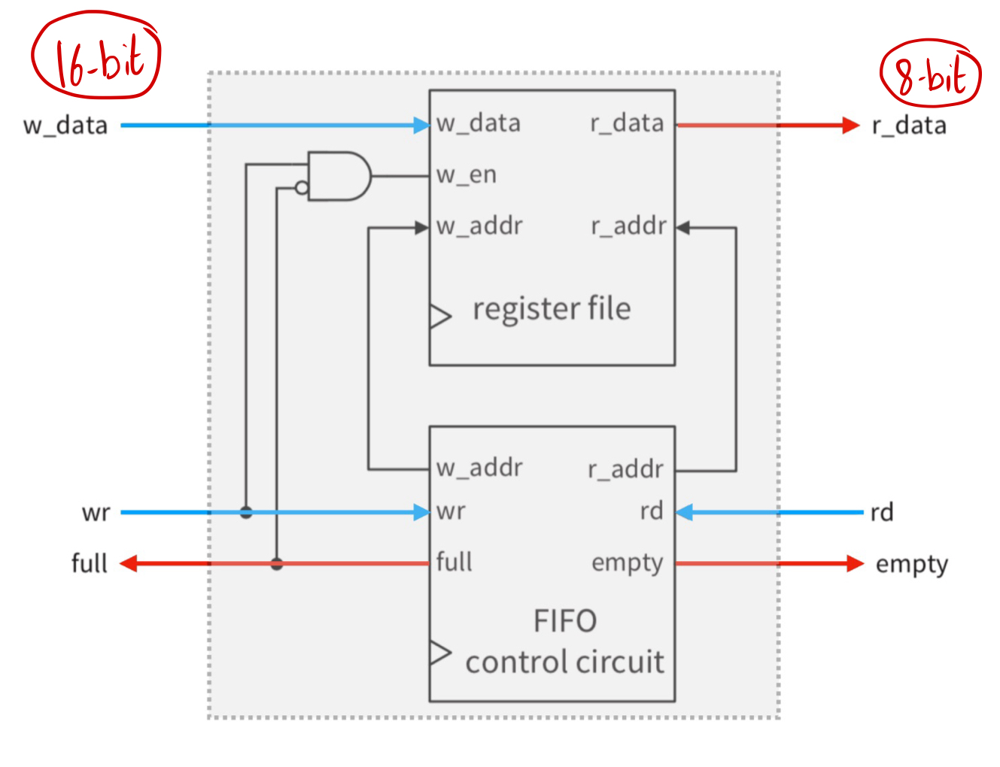
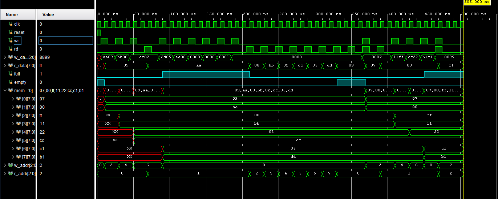
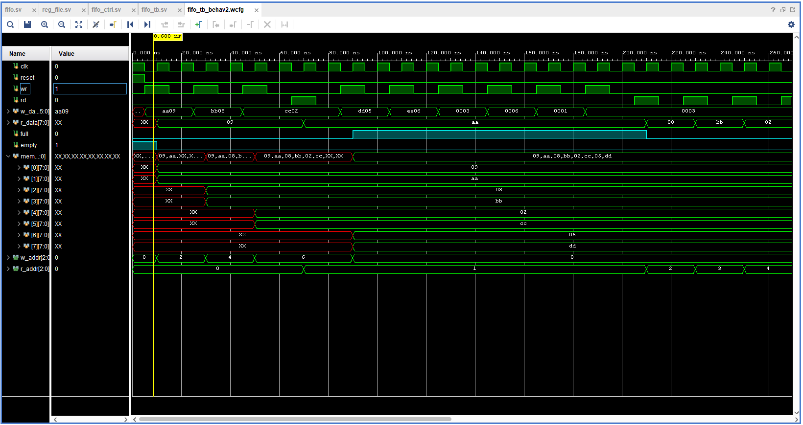
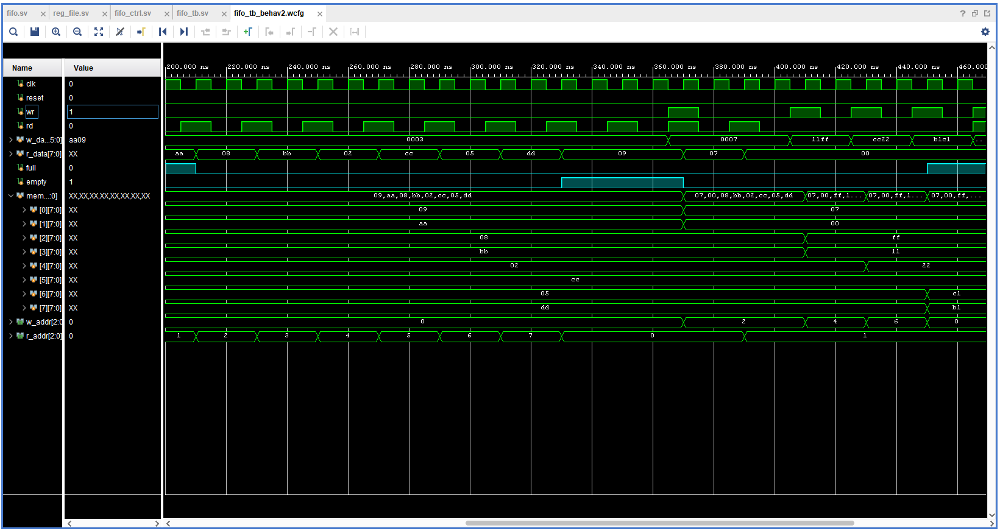

# Asymmetric Fifo Buffer

The design of the Asymmetric FIFO Buffer: 

`------------------------------------------------------------------------------------------------------------`

Screenshot of the simulation output: 

Zoomed-in screenshot of the simulation output (part 1): 

Zoomed-in screenshot of the simulation output (part 2): 

