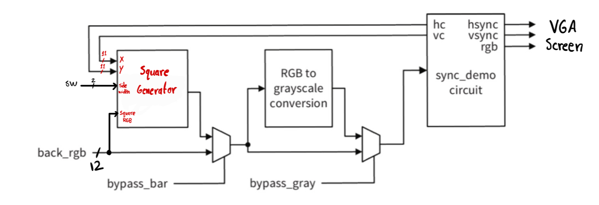
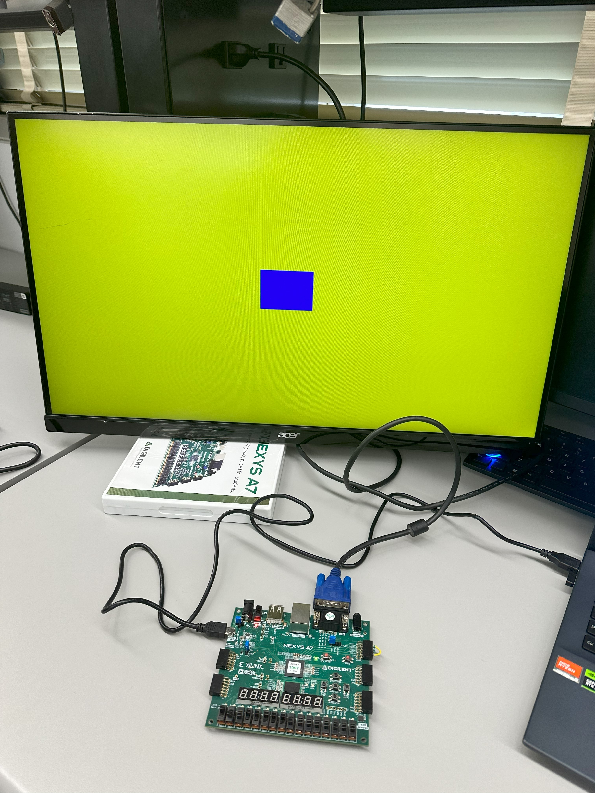
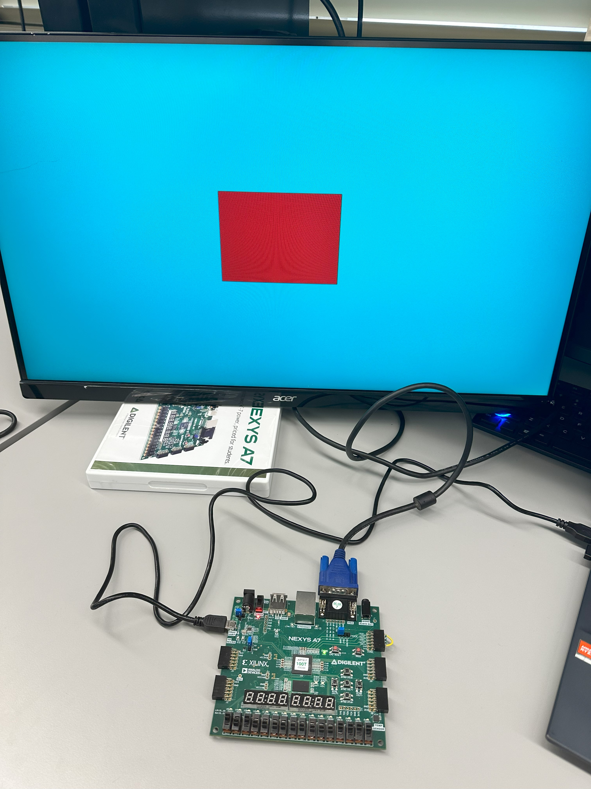
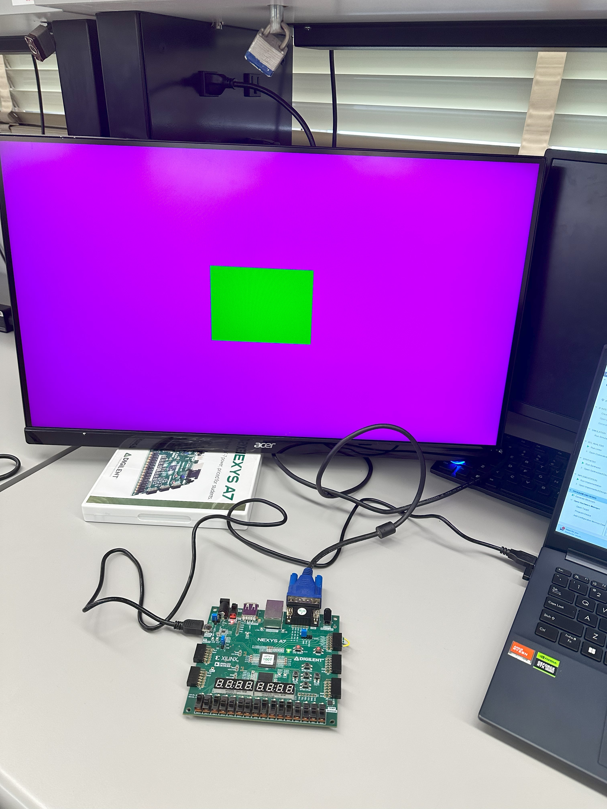

# Square Pattern Generator

## VGA demo system diagram: 

## Examples of squares on the VGA screen: 

Example 1: blue square with 16 pixels width:

Example 2: Red square with 64 pixels width:

Example 2: Green square with 32 pixels width:

