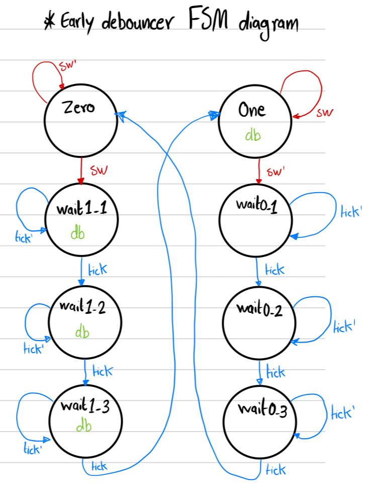
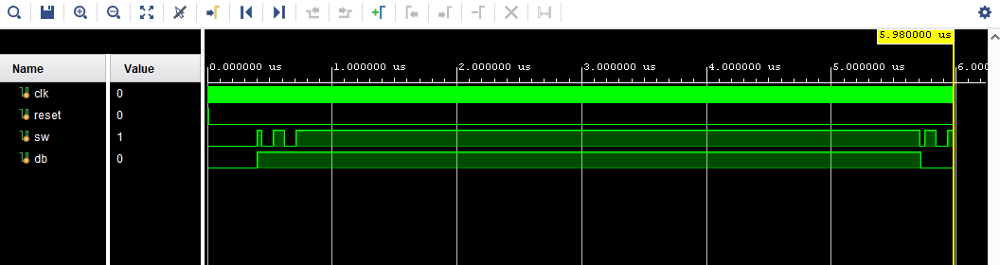

# Early Debouncer
Debouncing circuits are used in digital electronics to remove noise or bounce from the input signal, especially in applications where mechanical switches are used. Delayed and early debouncer circuits are variations of debouncing circuits that aim to address specific timing issues in the signal transition.

Early Debouncer FSM Diagram:

Screenshot of the test_bench of the early debouncer circuit: 

